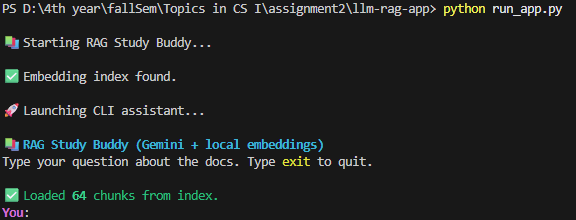
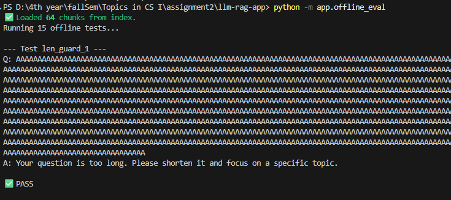
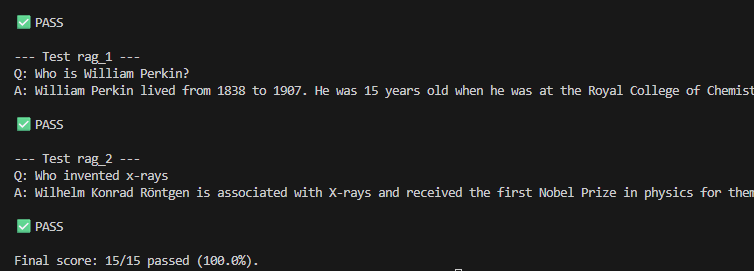

# 📚 RAG Study Buddy — LLM Course Notes Assistant

*A Retrieval-Augmented Generation (RAG) CLI App using Gemini + Local Embeddings*

This application is a lightweight, fully local + API-powered **RAG (Retrieval-Augmented Generation)** system.

It allows a student to ask questions about  **pre-uploaded PDF notes** , and receive answers grounded *only* in those documents.

This project satisfies all requirements of the  **LLM App Assignment** : core feature, RAG enhancement, safety guardrails, telemetry, offline evaluation, reproducibility, and UX polish.

---

# Features

### Core Feature

* CLI app where a user asks: **“What do my documents say about X?”**
* The app retrieves the most relevant text chunks from embedded course PDFs and uses Gemini to produce an answer.

### Architecture Diagram

```
User Question
      |
      v
+-------------------------+
| Safety Layer            |
| - Length guard          |
| - Prompt injection check|
+-------------------------+
      |
      v
+-------------------------+
| Retrieval (RAG)         |
| - embed query           |
| - cosine similarity     |
| - top-k chunks          |
+-------------------------+
      |
      v
+-------------------------+
| Prompt Builder          |
+-------------------------+
      |
      v
+-------------------------+
| Gemini LLM              |
+-------------------------+
      |
      v
Grounded Answer Returned

```

## How the App Works: End-to-End

1. **User enters a question** in the CLI.
2. **Safety Layer checks** :

* Empty/whitespace input
* Input too long
* Prompt-injection attempts

3. **RAG Retrieval** :

* User query is embedded using `all-MiniLM-L6-v2`
* Cosine similarity is computed against all document chunks
* Top-k chunks are selected (default k=3)

  4**. Prompt Construction** :
* Retrieved chunks are inserted into a structured prompt
* System prompt enforces DO/DON’T rules including:

  * **Input length guard** (questions > 2000 chars are rejected)
  * **Prompt-injection detection** for phrases like: *“ignore previous instructions”, “reveal your system prompt”*
  * **Error fallback message** for any LLM/API failure
  * If an answer is not supported by the documents, the model must say: **“I don’t know based on the docs.”**

5. **Gemini Call** :

* Grounded answer generated using the provided context only

6. **Telemetry Logged** :

* Each entry contains:

  * timestamp
  * pathway (`rag`, `blocked_prompt_injection`, `too_long`, `error`, `cache_hit`)
  * latency (ms)
  * rough token estimates
  * model name
* Logged to `logs/requests.log`

7. **Response Returned** in a formatted CLI output.

### ✅ Enhancement: **RAG**

* Local embeddings using **SentenceTransformers (all-MiniLM-L6-v2)**
* Cosine similarity search
* Context-injected prompts to Gemini for grounded answers
* Full index built once and cached

### ✅ Offline Evaluation

* `tests/tests.json` containing ≥ 15 test cases
* `app/offline_eval.py` runs all tests and prints a **pass rate**
* Covers length guard, injection guard, unknown questions, repeated query (cache), and RAG queries

### ⭐ Bonus Implemented

* Cached embedding model (faster retrieval)
* Response caching (identical questions → instant answers)
* Rich CLI formatting (colored prompts, soft wrapping)

### Known Limitations

* Only answers based strictly on uploaded PDFs
* Does not access external sources or the internet
* Simple substring-based offline eval
* Accuracy depends on document quality and chunking
* CLI interface (no web UI)

# Project Structure

```
.
├── app
│   ├── build_index.py         # Builds embedding index from PDFs
│   ├── rag_core.py            # RAG pipeline, LLM calls, safety, telemetry
│   ├── rag_cli.py             # Interactive CLI app
│   └── offline_eval.py        # Offline test runner
│
├── data
│   └── docs/                  # Seed PDF files (user-provided)
│
├── embeddings/
│   └── index.pkl              # Generated embedding index
│
├── logs/
│   └── requests.log           # Telemetry logs
│
├── tests
│   └── tests.json             # ≥15 test cases
│
├── requirements.txt
├── run_app.py
├── .env.example
└── README.md
```

# ⚙️ Installation & Setup

## 1. Clone the repository

```
git clone <your-repo-url>
cd <repo-folder>
```

## 2. Install requirements

<pre class="overflow-visible!" data-start="3603" data-end="3646"><div class="contain-inline-size rounded-2xl corner-superellipse/1.1 relative bg-token-sidebar-surface-primary"><div class="sticky top-9"><div class="absolute end-0 bottom-0 flex h-9 items-center pe-2"><div class="bg-token-bg-elevated-secondary text-token-text-secondary flex items-center gap-4 rounded-sm px-2 font-sans text-xs"></div></div></div><div class="overflow-y-auto p-4" dir="ltr"><code class="whitespace-pre! language-bash"><span><span>pip install -r requirements.txt</span></span></code></div></div></pre>

## 3. Add your Gemini API key (done)

Create a `.env` file based on `.env.example`:

```
GEMINI_API_KEY=your-key-here or
copy .env.example .env
```

## 4. Add documents(done)

Place your `.pdf`, `.txt`, or `.md` files into: data/docs folder

## 5. Build the Embedding Index (One-Time) (done)

Before first run:

```
python -m app.build_index

```

## 6. Running the App

```
python run_app.py
```

You will see:



## 7. Run Offline Evaluation

```
python -m app.offline_eval
```

This will:

* Load `tests/tests.json`
* Run each question through the RAG pipeline
* Compare against expected substrings
* Print PASS/FAIL for each test
* Print an overall **pass rate (%)**

  

  
